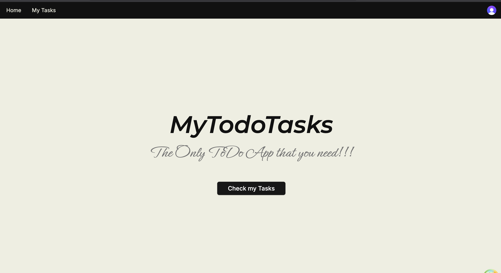
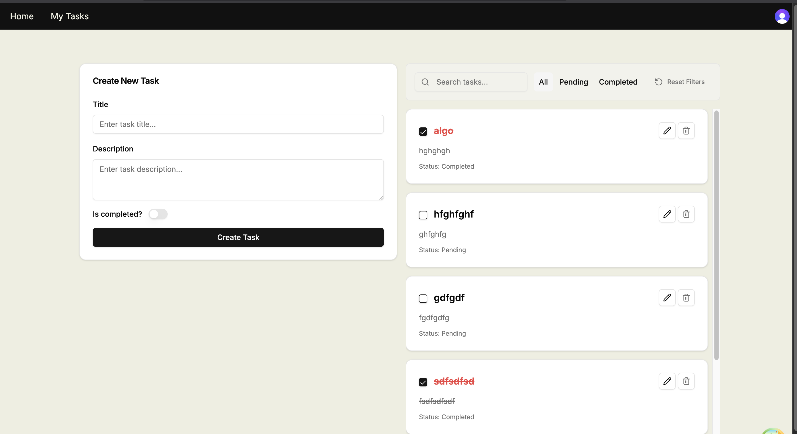
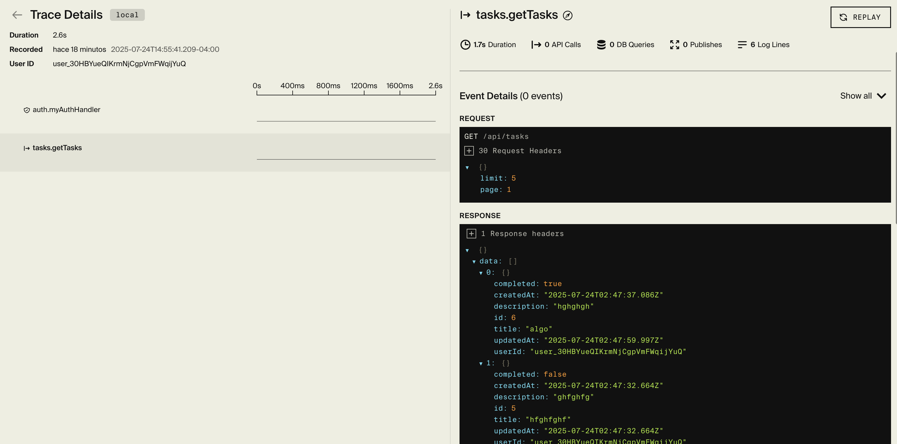
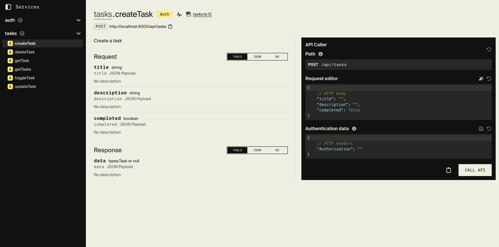
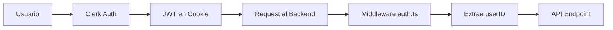

# TODO APP





# Estructura del Proyecto

```
nextjs-starter/
├── 📁 backend/                          # Backend con Encore.dev
│   ├── 📁 auth/                         # Autenticación con Clerk
│   │   ├── auth.ts                      # Configuración de autenticación
│   │   ├── auth.test.ts                 # Tests de autenticación
│   │   └── encore.service.ts            # Servicio Encore para auth
│   ├── 📁 middleware/                   # Middleware personalizado
│   │   ├── errorHandler.test.ts         # Tests de manejo de errores
│   │   └── globalErrorHandler.test.ts   # Tests de middleware global
│   ├── 📁 prisma/                       # Base de datos con Prisma
│   │   ├── schema.prisma                # Esquema de la base de datos
│   │   └── 📁 migrations/               # Migraciones de la BD
│   ├── 📁 tasks/                        # API de tareas
│   │   ├── tasks.ts                     # Endpoints CRUD de tareas
│   │   ├── tasks.test.ts                # Tests de la API de tareas
│   │   └── encore.service.ts            # Servicio Encore para tasks
│   ├── 📁 types/                        # Tipos TypeScript
│   │   └── tasks.ts                     # Tipos para las tareas, necesarios para generar el codegen correcto 
│   ├── 📁 utils/                        # Utilidades del backend
│   │   └── trace.test.ts                # Tests de utilidades para medir tiempo de ejecución de bloques de código
│   ├── encore.app                       # Configuración de Encore
│   ├── package.json                     # Dependencias del backend
│   ├── tsconfig.json                    # Configuración TypeScript
│   ├── vitest.config.ts                 # Configuración de tests
│   └── TESTING.md                       # Documentación de tests
├── 📁 frontend/                         # Frontend con Next.js 14
│   ├── 📁 app/                          # App Router de Next.js
│   │   ├── 📁 hooks/                    # Custom hooks
│   │   │   ├── useTasks.ts              # Hook para gestión de tareas usando React Query
│   │   │   └── __tests__/               # Tests de hooks
│   │   ├── 📁 lib/                      # Librerías y utilidades
│   │   │   ├── client.ts                # Cliente RPC para backend
│   │   │   ├── getRequestClient.ts      # Configuración del cliente
│   │   │   └── getClientRequestClient.ts # Cliente alternativo
│   │   ├── 📁 tasks/                    # Páginas de tareas
│   │   │   ├── 📁 components/           # Componentes específicos de tareas
│   │   │   │   ├── TaskCard.tsx         # Tarjeta de tarea individual
│   │   │   │   ├── TaskFormEditor.tsx   # Editor de formularios
│   │   │   │   ├── TaskFilters.tsx      # Filtros de tareas
│   │   │   │   ├── TaskPagination.tsx   # Paginación
│   │   │   │   ├── TasksStateMessage.tsx # Mensajes de estado
│   │   │   │   └── __tests__/           # Tests de componentes
│   │   │   ├── page.tsx                 # Página principal de tareas
│   │   │   └── __tests__/               # Tests de página
│   │   ├── layout.tsx                   # Layout principal
│   │   ├── page.tsx                     # Página de inicio
│   │   ├── globals.css                  # Estilos globales
│   │   └── providers.tsx                # Providers de React
│   ├── 📁 components/                   # Componentes reutilizables
│   │   ├── 📁 ui/                       # Componentes de Shadcn/UI
│   │   │   ├── alert.tsx                # Componente de alerta
│   │   │   ├── button.tsx               # Botón
│   │   │   ├── card.tsx                 # Tarjeta
│   │   │   ├── checkbox.tsx             # Checkbox
│   │   │   ├── input.tsx                # Input
│   │   │   ├── label.tsx                # Label
│   │   │   ├── switch.tsx               # Switch
│   │   │   └── textarea.tsx             # Textarea
│   │   └── 📁 custom/                   # Componentes personalizados
│   │      
│   ├── 📁 lib/                          # Utilidades del frontend
│   │   └── utils.ts                     # Funciones utilitarias
│   ├── 📁 public/                       # Archivos estáticos
│   ├── package.json                     # Dependencias del frontend
│   ├── next.config.mjs                  # Configuración de Next.js
│   ├── tailwind.config.ts               # Configuración de Tailwind CSS
│   ├── components.json                  # Configuración de Shadcn/UI
│   ├── middleware.ts                    # Middleware de Next.js
│   ├── vitest.config.ts                 # Configuración de tests
│   └── test-setup.ts                    # Setup de tests
├── 📁 docs/                             # Documentación
│   └── 📁 images/                       # Imágenes para documentación
├── docker-compose.yml                   # Configuración de Docker
├── start-dev.sh                         # Script de inicio con Docker
├── .gitignore                           # Archivos ignorados por Git
├── todo.todo                            # Lista de tareas pendientes
└── README.md                            # Este archivo
```

## 🏗️ **Arquitectura del Proyecto**

### **Backend (Encore.dev)**
- **Framework**: [Encore.dev](https://encore.dev) con TypeScript - Alternativa moderna a NestJS y Express, ofrece un framework completamente tipado que es **8x más rápido** que Express al estar escrito parcialmente en Rust. Su característica más destacada es la generación automática de **RPC tipado** que permite llamar a endpoints del backend desde el frontend como funciones nativas con tipado completo, no solo como endpoints REST tradicionales.
- **Base de datos**: PostgreSQL con Prisma ORM, desplegado en [Neon.com](https://neon.com) - Base de datos serverless moderna con excelente rendimiento y escalabilidad automática.
- **Autenticación**: [Clerk](https://clerk.com) - Alternativa popular a Supabase Auth, Auth0, Logto o AWS Cognito, especialmente valorada en la comunidad de React/React Native por su facilidad de implementación y excelente experiencia de desarrollador.
- **Testing**: Vitest - Framework de testing moderno y rápido para TypeScript
- **API**: RESTful con endpoints completamente tipados y generación automática de cliente RPC

### **Frontend (Next.js 14)**
- **Framework**: Next.js 14 con App Router - Framework React de última generación con renderizado híbrido
- **UI**: Shadcn/UI + Tailwind CSS - Sistema de componentes moderno y altamente personalizable
- **Estado**: [React Query (TanStack Query)](https://tanstack.com/query) - Simplifica significativamente el cacheo de datos y la invalidación automática, eliminando en muchos casos la necesidad de usar un estado centralizado como Redux o Zustand
- **Autenticación**: Clerk - Integración nativa con el sistema de autenticación
- **Testing**: Vitest + React Testing Library - Testing moderno y accesible
- **Cliente API**: RPC tipado generado automáticamente por Encore en `frontend/app/lib/client.ts` - Este archivo se genera automáticamente desde el backend y proporciona métodos tipados para llamar a todos los endpoints como funciones nativas de TypeScript

### **Características Principales**
- ✅ **Autenticación completa** con Clerk
- ✅ **CRUD de tareas** con filtros y paginación
- ✅ **API tipada** entre frontend y backend con RPC automático
- ✅ **Tests unitarios** en ambos lados
- ✅ **Docker** para desarrollo
- ✅ **UI moderna** con Shadcn/UI
- ✅ **Performance optimizada** con Encore.dev (8x más rápido que Express)
- ✅ **Base de datos serverless** con Neon.com

# 🚀 Instalación y Configuración

## 📋 **Prerrequisitos**

Antes de comenzar, asegúrate de tener instalado:

- **Node.js** (versión 18 o superior)
- **npm** o **yarn**
- **Encore CLI** - [Instrucciones de instalación](https://encore.dev/docs/go/install#install-the-encore-cli)
- **Docker** (opcional, solo si usas Docker Compose)

## 🔧 **Configuración del Entorno**

### **Opción 1: Desarrollo Local (Recomendado)**

#### **1. Configurar el Backend**

```bash
# Navegar al directorio del backend
cd backend

# Instalar dependencias
npm install

# Configurar variables de entorno
cp .env.sample .env
# Editar .env con tus credenciales de Clerk y base de datos

# Inicializar la aplicación Encore
encore app init
```

#### **2. Configurar el Frontend**

```bash
# Navegar al directorio del frontend
cd frontend

# Instalar dependencias
npm install

# Configurar variables de entorno
cp .env.local.sample .env.local
# Editar .env.local con tus credenciales
```

### **Opción 2: Docker Compose**

```bash
# Configurar variables de entorno
cp .env.sample .env
# Editar .env con tus credenciales

# Dar permisos de ejecución al script
chmod +x start-dev.sh

# Ejecutar el entorno completo
./start-dev.sh
```

## 🏃‍♂️ **Ejecutar la Aplicación**

### **Backend**

```bash
cd backend
npm run dev
```

El backend estará disponible en **http://127.0.0.1:9400**

### **Frontend**

```bash
cd frontend
npm run dev
```

El frontend estará disponible en **http://localhost:3000**

## 📊 **Dashboard de Desarrollo**

Una vez que el backend esté ejecutándose, puedes acceder al **Encore Dev Dashboard** en:

**http://127.0.0.1:9400**

Este dashboard te permite:
- 📋 Ver todos los servicios disponibles
- 📚 Consultar la documentación de la API
- 🧪 Probar endpoints directamente (similar a Postman)
- 📊 Monitorear el rendimiento de la aplicación




# Implementación Autenticación/Autorización

## 🔐 **Sistema de Autenticación con Clerk**

### **Arquitectura de Autenticación**

Este proyecto utiliza **Clerk** como proveedor de autenticación, siguiendo un patrón similar a Auth0 o AWS Cognito. La implementación está diseñada para ser simple, segura y escalable.

### **¿Por qué no hay tabla de usuarios en el backend?**

A diferencia de sistemas de autenticación tradicionales, **no se requiere una tabla de usuarios en la base de datos del backend**. Esto se debe a que:

- **Clerk maneja toda la autenticación** - Los usuarios se registran e inician sesión directamente en Clerk
- **JWT en cookies** - Clerk genera automáticamente tokens JWT que se almacenan en cookies seguras
- **Validación automática** - Cada request al backend incluye automáticamente la autenticación
- **Middleware centralizado** - El archivo `backend/auth/auth.ts` extrae y valida los datos del usuario

### **Flujo de Autenticación**



### **Implementación Técnica**

#### **1. Middleware de Autenticación (`backend/auth/auth.ts`)**

```typescript
// El middleware extrae automáticamente el userID de cada request
const auth = getAuthData();
if (!auth) {
  throw new APIError(ErrCode.Unauthenticated, "Unauthenticated");
}
// auth.userID contiene el ID único del usuario de Clerk
```

#### **2. Uso en Endpoints**

```typescript
// Ejemplo: Crear una tarea asociada al usuario autenticado
const task = await prisma.task.create({
  data: {
    title,
    description,
    completed,
    userId: auth.userID, // ID automático de Clerk
  },
});
```

### **Ventajas de esta Implementación**

✅ **Simplicidad** - No hay gestión de usuarios en el backend  
✅ **Seguridad** - Clerk maneja toda la seguridad de autenticación  
✅ **Escalabilidad** - No hay sincronización de datos de usuario  
✅ **Desarrollo rápido** - No hay configuración compleja de autenticación  
✅ **Mantenimiento** - Actualizaciones de seguridad automáticas  

### **Alternativa: Webhook para Sincronización**

Aunque no es necesario, se podría implementar un webhook de Clerk que creara usuarios en la base de datos del backend al momento del registro. Sin embargo, esto:

- **Complica el desarrollo** - Requiere un dominio público para webhooks
- **Añade complejidad** - Sincronización de datos entre sistemas
- **No es necesario** - El `userID` de Clerk es suficiente para la mayoría de casos

### **Configuración**

La autenticación se configura automáticamente mediante:

- **Variables de entorno** en `.env` y `.env.local`
- **Middleware de Clerk** en el frontend
- **Middleware de autenticación** en el backend
- **Cookies seguras** manejadas por Clerk

### **Seguridad**

- **Tokens JWT** firmados por Clerk
- **Cookies httpOnly** para prevenir XSS
- **Validación automática** en cada request
- **No almacenamiento** de credenciales en el backend

## Projecto Basado en este Repo
Next.js + Encore TS Web App Starter

```bash
git clone --depth=1 https://github.com/encoredev/nextjs-starter.git
```

